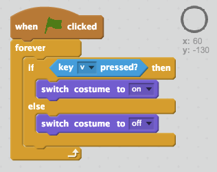
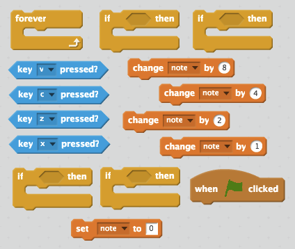
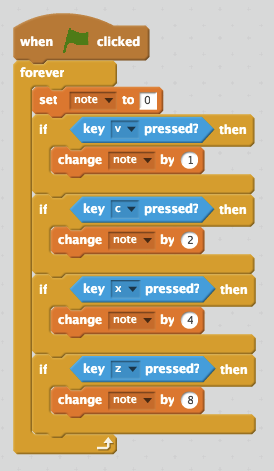

## Binary notes

How many notes can you play with four keys? It might be more than you think!

+ Open the starter project.

--- collapse ---
---
title: I'm using Scratch online
image: images/image.png
---
Open the 'Binary Hero' Scratch starter project at  [jumpto.cc/binary-go](http://jumpto.cc/binary-go){:target="_blank"}.
--- /collapse ---

--- collapse ---
---
title: I'm using Scratch offline
image: images/image.png
---
Download the [binary-hero.sb2](resources/binary-hero.sb2){:target="_blank"} Scratch starter project and open it using the offline editor.

If you have a Scratch account, you can click on __Remix__ in the top right-hand corner to save a copy of the project to your account.
--- /collapse ---

+ Let's start by showing which keys have been pressed. Click on the sprite called '1', and add code to change its costume when the `v` key is pressed.

When you test your sprite by pressing the `v` key, the sprite should light up.

--- hints ---
--- hint ---
When the `flag is clicked`, your sprite should check `forever` whether the `v key is pressed`. `If` the key is pressed, the 'on' `costume` should be shown, `else` the 'off' `costume` should be shown.
--- /hint ---
--- hint ---
Here are the code blocks you'll need:

--- /hint ---
--- hint ---
This is what your code should look like:

--- /hint ---
--- /hints ---

[[[generic-scratch-saving]]]

+ Do the same for the other three sprites, so that they light up when the `c`, `x`, and `z` keys are pressed.

### Binary numbers

In this project you'll be using combinations of the four different keys to play different notes. You can think of each of the keys as either on (pressed) or off (not pressed). This means that you can think of each combination of keys as a __binary number__.

Moving from right to left the keys double in value, and are `1`, `2`, `4`, and `8`. By adding up the numbers above each key you can work out the value of the note.

There are 24 = __16 combinations__ that can be made with the four keys. This means that we can play 15 different notes, as `0` will mean that no note is played.

+ Create a new variable called `note`, and drag it next to the 4 note sprites.

[[[generic-scratch-add-variable]]]

+ Add code to the Stage to use the keys pressed to calculate the value of the note to be played.

For example, when `c` and `v` are pressed, the value of `note` should be `3`.

--- hints ---
--- hint ---
When the `flag is clicked`, the `note` variable should be `set` to `0`.

+ `If` the `v key is pressed`, the `note` should be `changed by 1`
+ `If` the `c key is pressed`, the `note` should be `changed by 2`
+ `If` the `x key is pressed`, the `note` should be `changed by 4`
+ `If` the `z key is pressed`, the `note` should be `changed by 8`

All of this code should be repeated `forever`.
--- /hint ---
--- hint ---
Here are the code blocks you'll need:

--- /hint ---
--- hint ---
This is what your code should look like:

--- /hint ---
--- /hints ---
