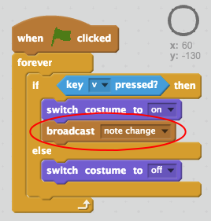
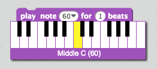
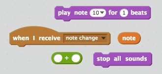
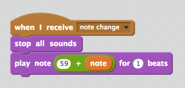
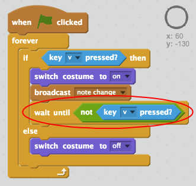

## Playing notes

Let's play notes when keys are pressed.

+ Broadcast a 'note change' message whenever __each of the 4 keys__ are pressed.

+ Add code to the **stage** to play a note when a combination of keys are pressed.

Your notes should start at Middle C, which is note 60.

--- hints ---
--- hint ---
When your stage __receives__ the 'change note' message, it should __stop all sounds__ before __playing a note__ based on the value of your `note` variabe.

+ When your `note` variable is 1, note 60 should be played.
+ When your `note` variable is 2, note 61 should be played.
+ When your `note` variable is 3, note 62 should be played.
+ etc...
--- /hint ---
--- hint ---
Here are the code blocks you'll need:

--- /hint ---
--- hint ---
This is what your code should look like:

--- /hint ---
--- /hints ---

+ Test your code and you'll notice that the note is repeatedly played when a key is held down.

<video width="400" controls>
  <source src="images/play-note-bug.mp4" type="video/mp4">
  Your browser does not support HTML5 video.
</video>

+ Can you add code to the **key sprites** only play a note __once__ when a key is held down?

--- hints ---
--- hint ---
When each of the z, x, c and c keys are pressed, your code should __wait until__ the __key is not pressed__ before continuing.
--- /hint ---
--- hint ---
Here are the code blocks you'll need:

--- /hint ---
--- hint ---
This is what your code should look like:

--- /hint ---
--- /hints ---
