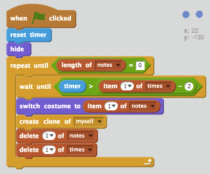
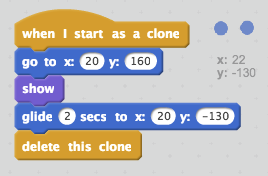

## Scrolling notes

Scroll notes down the stage so that the player knows which keys to press.

+ Create 2 lists, called `notes` and `times`.

[[[generic-scratch-make-list]]]

+ Add the following numbers to your `notes` and `times` lists. __Make sure to add the exact numbers in the right order__.

+ Here's how songs will be stored:

    + The `notes` list stores the notes of the song, in order (from 1 to 15).
    + The `times` list is used to store the times that each note is played.

    

    So for the data above:

    + Note 1 (Middle C) should be played at 5 seconds
    + Note 1 should be played again at 5.5 seconds
    + Note 3 should be played at 6 seconds
    + etc...

+ Right-click on the 'note' sprite and click 'show'.

+ If you click 'Costumes', you should see that the sprite has 15 different costumes; one for each note.

+ Add code to create a clone of the 'note' sprite for every note to be played. Each clone should be created 2 seconds before the time the note should be played, and should then move down the stage.

Nothing will seem to happen when you test your code, because the 'note' sprite is hidden. If you show (or don't hide) the sprite then you should see clones being created on top of each other.

--- hints ---
--- hint ---
When the __flag is clicked__ the 'note' sprite should __hide__, and the __timer__ should be __reset__.

You should then __wait until__ the timer is __greater than__ the next note to be played, which will be the `time` at the __start of the list__ (__minus 2 seconds__).

The costume for the 'note' sprite should then be set to the next `note` to be played (the `note` at the start of the list) before creating a __clone__ of the note sprite.

The items at the start of the `notes` and `times` lists can then be __deleted__, and the entire process should be __repeated until__ there are no notes left.

--- /hint ---
--- hint ---
Here are the code blocks you'll need:

--- /hint ---
--- hint ---
This is what your code should look like:

--- /hint ---
--- /hints ---

+ Now add code to make each note clone glide form the top to the bottom of the screen before being deleted.

--- hints ---
--- hint ---
When each __clone starts__, it should be __shown__ and should __go to__ the top of the screen. The clone should then __glide__ for __2 seconds__ until it reaches the 4 'key' sprites, at which point the clone can be __deleted__.
--- /hint ---
--- hint ---
Here are the code blocks you'll need:

--- /hint ---
--- hint ---
This is what your code should look like:

--- /hint ---
--- /hints ---
