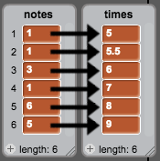
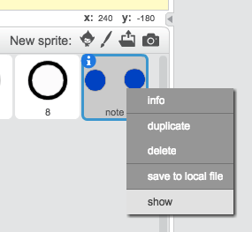
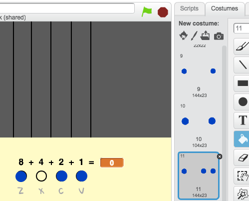
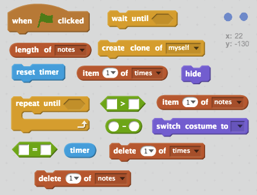
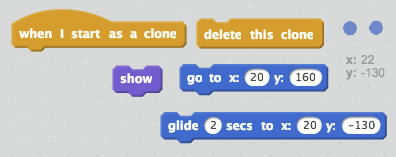

## Scrolling notes

Scroll notes down the stage so that the player knows which keys to press.

+ Create two lists called `notes` and `times`.

[[[generic-scratch-make-list]]]

+ Add the following numbers to your `notes` and `times` lists. Note: make sure to add these exact numbers in the right order.

+ Here's how songs will be stored:

    + The `notes` list stores the notes of the song, in order (from 1 to 15).
    + The `times` list is used to store the times that each note is played.

    

    So for the data above:

    + Note 1 (middle C) should be played at 5 seconds
    + Note 1 should be played again at 5.5 seconds
    + Note 3 should be played at 6 seconds
    + etc...

+ Right-click on the 'note' sprite and click **show**.

+ If you click **Costumes**, you should see that the sprite has 15 different costume, one for each note.

+ Add code to create a clone of the 'note' sprite for every note to be played. Each clone should be created two seconds before the time the note should be played, and should then move down the stage.

This will give the clone two seconds to move down the screen. You'll create the code to move your clones in a little bit!

Nothing will seem to happen when you test your code, because the 'note' sprite is hidden. If you show (or don't hide) the sprite, then you should see clones being created on top of each other.

--- hints ---
--- hint ---
When the `flag is clicked` the 'note' sprite should `hide`, and the `timer` should be `reset`.

You should then `wait until` the timer is `greater than` the next note to be played, which will be the `time` at the `start of the list` (`minus 2 seconds`).

The costume for the 'note' sprite should then be set to the next `note` to be played (the `note` at the start of the list), before a `clone` of the note sprite is created.

The items at the start of the `notes` and `times` lists can then be `deleted`, and the entire process should be `repeated until` there are no notes left.

--- /hint ---
--- hint ---
Here are the code blocks you'll need:

--- /hint ---
--- hint ---
This is what your code should look like:

--- /hint ---
--- /hints ---

+ Now add code to make each note clone glide from the top to the bottom of the screen before being deleted.

--- hints ---
--- hint ---
When each `clone starts`, it should be `shown` and should `go to` the top of the screen. The clone should then `glide` for `2 seconds` until it reaches the four 'key' sprites, at which point the clone can be `deleted`.
--- /hint ---
--- hint ---
Here are the code blocks you'll need:

--- /hint ---
--- hint ---
This is what your code should look like:

--- /hint ---
--- /hints ---
