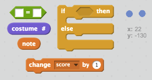

## Keeping score

Improve your game by giving the player points each time the correct note is played.

+ Create a new variable called `score`, and place it at the top of your stage.

+ Add to the player's score whenever they play the correct note at the correct time. Remember to set their score to `0` at the start of the game.

--- hints ---
--- hint ---
__Before each clone is deleted__, it should check to see __if__ the __note__ is __equal to__ the __costume number__. If they are the same, the score can be __changed__.
--- /hint ---
--- hint ---
Here are the code blocks you'll need:

--- /hint ---
--- hint ---
This is what your code should look like:

--- /hint ---
--- /hints ---

+ Broadcast a message called 'got' when the correct note is played.

+ Add code to your **stage** to briefly change how it looks when the player plays the correct note.

--- hints ---
--- hint ---
When your stage __receives__ the 'got' message, it should __change color__, __wait__ for a short time before __clearing the graphic effects__.
--- /hint ---
--- hint ---
Here are the code blocks you'll need:

--- /hint ---
--- hint ---
This is what your code should look like:

--- /hint ---
--- /hints ---
